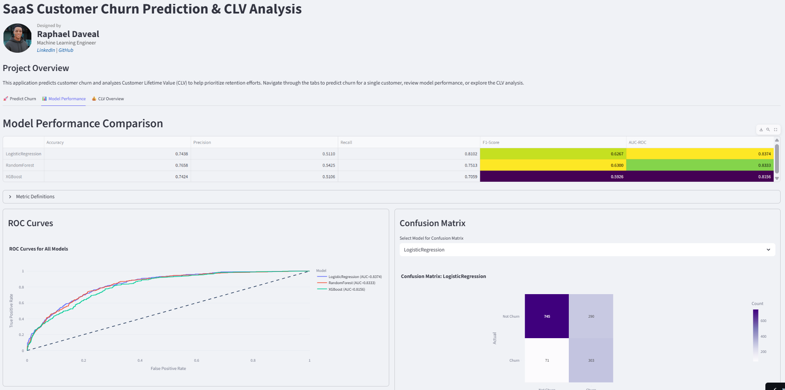

# SaaS Customer Churn & Lifetime Value Prediction

[](https://churn-analysis-by-dave.streamlit.app/)

An end-to-end machine learning application that predicts customer churn and analyzes Customer Lifetime Value (CLV) to enable data-driven retention strategies. The project is deployed as an interactive web app using Streamlit.

**Live App URL:** https://churn-analysis-by-dave.streamlit.app/

**Video Demo:** `[INSERT YOUR YOUTUBE/LOOM VIDEO LINK HERE]`

---



## 1. Business Problem

In the competitive SaaS and telecommunications industries, customer churn is a major drain on revenue, with companies losing an average of 5-7% annually. Acquiring new customers is significantly more expensive than retaining existing ones. This project tackles this challenge by addressing two fundamental questions:

1.  **Who is likely to churn?** By leveraging machine learning, we can proactively identify customers at high risk of leaving.
2.  **Which customers should we prioritize?** Not all customers are equally valuable. By estimating Customer Lifetime Value (CLV), we can focus retention efforts on high-value customers, maximizing the ROI of retention campaigns.

## 2. Key Features

*   **Churn Prediction:** Utilizes three distinct models (Logistic Regression, Random Forest, XGBoost) to predict the probability of a customer churning.
*   **Customer Lifetime Value (CLV) Analysis:** Segments customers into value quartiles (Low, Medium, High, Premium) and analyzes churn rates across these segments to identify vulnerable, high-value groups.
*   **Interactive Prediction Tool:** A user-friendly form within the app allows for real-time churn prediction on a single customer.
*   **Model Interpretability:** Employs SHAP (SHapley Additive exPlanations) to explain model predictions, providing transparency into which factors (e.g., contract type, tenure) are driving a customer's churn risk.
*   **Performance Dashboard:** A dedicated tab to compare the performance of all three models using key metrics like Precision, Recall, F1-Score, and AUC-ROC.

## 3. Methodology

### Data Source & Preparation

The project uses the publicly available **IBM Telco Customer Churn** dataset. The preparation pipeline, executed in `src/data_prep.py`, involves:
*   **Cleaning:** Imputing missing `TotalCharges` for new customers (tenure=0) with a value of 0.
*   **Feature Engineering:** Creating new, business-relevant features such as:
    *   `tenure_bucket`: Grouping customers by their tenure length.
    *   `services_count`: The total number of services a customer subscribes to.
    *   `no_tech_support_flag`: A binary flag for at-risk customers with internet but no tech support.
*   **Preprocessing:** Using a `scikit-learn` pipeline to scale numerical features and one-hot encode categorical features, which is then saved to prevent data leakage during prediction.

### Customer Lifetime Value (CLV) Assumption

For this project, CLV is calculated as a proxy representing the historical revenue generated by a customer:

```
CLV = MonthlyCharges × tenure (in months)
```

This simple, interpretable metric effectively segments customers based on their past value to the business, providing a solid foundation for prioritizing retention efforts.

## 4. Tech Stack

*   **Backend & ML:** Python, Pandas, Scikit-learn, XGBoost
*   **Frontend & Deployment:** Streamlit, Streamlit Community Cloud
*   **Interpretability:** SHAP
*   **Data Visualization:** Matplotlib

## 5. How to Run Locally

Follow these steps to set up and run the project on your local machine.

### Prerequisites
*   Python 3.9+
*   A virtual environment tool (e.g., `venv`, `conda`)

### Step-by-Step Instructions

1.  **Clone the Repository**
    ```bash
    git clone https://github.com/daveralphy/churn-analysis-by-dave.git
    cd church-analysis-by-dave
    ```

2.  **Create and Activate a Virtual Environment**
    *Using `venv`:*
    ```bash
    python -m venv venv
    source venv/bin/activate  # On Windows: venv\Scripts\activate
    ```

3.  **Install Dependencies**
    ```bash
    pip install -r requirements.txt
    ```

4.  **Prepare Data and Train Models**
    Run the following scripts to process the data and train the models. The necessary artifacts will be saved to the `data/processed/` and `models/` directories.
    ```bash
    python src/data_prep.py
    python src/train_models.py
    ```

5.  **Launch the Streamlit App**
    ```bash
    streamlit run app.py
    ```
    The application will be available in your browser at `http://localhost:8501`.

## 6. Repository Structure

```
project2-churn-prediction/
├── README.md                 # Project overview and instructions
├── AI_USAGE.md               # Documentation of AI assistance
├── requirements.txt          # Project dependencies
├── app.py                    # The main Streamlit application file
├── data/
│   ├── raw/                  # Raw, untouched data
│   └── processed/            # Cleaned and processed data splits
├── models/
│   ├── preprocessor.pkl      # Saved preprocessor pipeline
│   ├── logisticregression.pkl# Saved Logistic Regression model
│   ├── randomforest.pkl      # Saved Random Forest model
│   └── xgboost.pkl           # Saved XGBoost model
├── src/
│   ├── data_prep.py          # Script for data loading and feature engineering
│   └── train_models.py       # Script for training and saving models
└── notebooks/
    └── exploration.ipynb     # (Optional) Jupyter notebook for exploratory analysis
```

---

*This project was developed as part of a data science curriculum. For questions or collaboration, please reach out.*